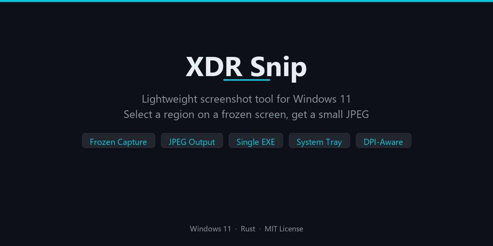

# XDR Snip

[](https://github.com/db-cynerg-ia/xdr-snip)
[](https://www.rust-lang.org/)
[](LICENSE)
[](https://github.com/db-cynerg-ia/xdr-snip/releases)

<p align="center">
  
</p>

Lightweight screenshot tool for Windows 11. Select a region on a frozen screen, save in your format of choice — ready to paste into Claude, browsers, or any app.

## Why

- **Windows clipboard sends uncompressed bitmaps** — a 1080p screenshot becomes 6MB+ when pasted, crashing Claude Code conversations
- **XDR Snip compresses intelligently** — captures from a frozen screen overlay, encodes to your chosen format (JPEG, PNG, WebP, AVIF, TIFF, BMP, QOI, or OpenEXR)
- **What you select is what you get** — the output matches exactly what you saw during selection, even if the underlying screen changes

## Features

- **Print Screen** → fullscreen frozen overlay → drag to select region
- **HDR + WCG + SDR** — WinRT Graphics Capture with Extended Reinhard tone mapping for HDR, max-channel Reinhard for Wide Color Gamut; automatic GDI fallback
- **Frozen capture** — screen freezes instantly; pixels are extracted from the snapshot, not a live re-capture
- **8 output formats** — JPEG (with chroma subsampling), PNG, WebP (lossy + lossless), AVIF, TIFF, BMP, QOI, OpenEXR (preserves raw HDR f16 data)
- **Per-format settings** — quality sliders, compression levels, filter strategies — all tunable from the settings dialog
- **Clipboard + file** — copies to clipboard and saves to `~/Pictures/XDR-Snips/`
- **System tray** — right-click for Take Screenshot, Open Folder, Settings, Quit
- **Settings window** — format selector with per-format options, save path, all without editing config files
- **Capture preview** — popup with thumbnail, dimensions, file size, clipboard status (auto-closes after 5s, click to open file)
- **Legacy config migration** — old configs with bare `quality` field auto-migrate to the new format
- **Single exe** — no installer, no dependencies, no .NET runtime
- **DPI-aware** — per-monitor DPI v2, correct coordinates on mixed-DPI setups

## Demo

<!-- Demo GIF: see assets/DEMO-RECORDING-GUIDE.md -->
> **Press PrintScreen** → screen freezes with dark overlay → **drag region** → release

The selected region appears at full brightness with a cyan border. Escape or right-click to cancel.

## Install

Download `xdr-snip.exe` from [Releases](https://github.com/db-cynerg-ia/xdr-snip/releases) and run it. No installation needed.

> **Important: Unbind Windows Snipping Tool first!**
>
> Windows 11 intercepts Print Screen before any app can see it. You must disable this:
>
> **Settings → Accessibility → Keyboard → toggle OFF "Use the Print Screen key to open screen capture"**
>
> Without this step, XDR Snip will never receive the hotkey.

## Build from source

```powershell
# Requires Rust toolchain (rustup.rs)
cargo build --release
# Output: target/release/xdr-snip.exe
```

## Configuration

Config file: `%APPDATA%\xdr-snip\config.toml` (created on first run with defaults)

```toml
[capture]
format = "jpeg"                       # jpeg, png, webp, avif, tiff, bmp, qoi, openexr
save_dir = "~/Pictures/XDR-Snips"     # Output directory
filename_pattern = "screenshot_{timestamp}"

[capture.format_options.jpeg]
quality = 85                          # 50-100 (recommended: 85)
chroma_subsampling = "4:2:2"          # "4:4:4", "4:2:2", "4:2:0"

[capture.format_options.png]
compression = 6                       # 0 (fast) to 9 (max)
filter = "adaptive"                   # adaptive, none, sub, up, average, paeth

[capture.format_options.webp]
lossless = false
quality = 80.0                        # 0-100 (lossy only)

[capture.format_options.avif]
quality = 80                          # 1-100
speed = 4                             # 1 (slowest/best) to 10 (fastest)

[hotkey]
key = "PrintScreen"                   # Trigger key
modifiers = []                        # Optional: ["Alt"], ["Ctrl", "Shift"], etc.

[behavior]
copy_to_clipboard = true
save_to_file = true
show_notification = true
```

## Architecture

Single Rust binary using the `windows` crate for Win32/GDI and WinRT APIs:

| Module | Role |
|--------|------|
| `main.rs` | DPI setup, message loop, hotkey + tray event dispatch, dual-capture orchestration |
| `hdr_capture.rs` | WinRT Graphics Capture — per-monitor HDR frame acquisition (D3D11, R16G16B16A16Float) |
| `overlay.rs` | Frozen-screen overlay (GDI BitBlt) with double-buffered region selection |
| `capture.rs` | HDR/WCG tone mapping (Extended Reinhard + max-channel Reinhard) + 8-format encoder dispatcher |
| `clipboard.rs` | Raw RGB8 pixels → clipboard image via `arboard` (format-agnostic, no decode roundtrip) |
| `preview.rs` | Capture preview popup — thumbnail + info text (click to open, auto-closes after 5s) |
| `settings.rs` | GUI settings dialog — format selector, per-format options, save path |
| `tray.rs` | System tray icon + context menu via `tray-icon` crate |
| `config.rs` | TOML config load/validate from `%APPDATA%` + legacy config migration |

### Capture Pipeline

1. User presses Print Screen
2. **WinRT** captures each monitor as `R16G16B16A16Float` (preserves HDR data)
3. **GDI** `BitBlt` captures the virtual screen for the frozen overlay display
4. Screen freezes: dimmed version shown as background, selected region at full brightness
5. User releases mouse → identifies target monitor
6. If WinRT frame available: crop + tone map (Extended Reinhard for HDR, max-channel Reinhard for WCG) → RGB8. Otherwise: GDI fallback via `GetDIBits`
7. Encode in configured format → file saved + clipboard set + preview popup. OpenEXR preserves raw f16 HDR data without tone mapping

## Release History

### v0.4.3 — Settings layout + 1080p size estimates (2026-02-27)

- **Tight layout** — eliminated gaps between standard and advanced controls; TIFF/EXR controls reposition to top when no standard controls above
- **1080p size estimate** — every format shows estimated file size for a 1920x1080 screenshot, updating in real-time as settings change

### v0.4.2 — Fix combo box rendering (2026-02-27)

- **Fix dropdown rendering** — combo boxes now render as proper popup dropdowns instead of inline lists (CBS_DROPDOWNLIST must be set at creation time, not after)

### v0.4.1 — Non-blocking settings + Standard/Advanced UX (2026-02-27)

- **Non-blocking settings** — settings dialog no longer freezes the app; screenshots can be taken while settings is open
- **Standard/Advanced toggle** — checkbox hides advanced options (chroma subsampling, PNG filters, AVIF speed, TIFF/EXR compression) by default; regular users see only quality/compression sliders
- **Duplicate window guard** — clicking "Settings" while already open is a no-op

### v0.4.0 — Multi-format output (2026-02-27)

- **8 output formats** — JPEG, PNG, WebP (lossy + lossless), AVIF, TIFF, BMP, QOI, OpenEXR
- **Per-format options** — quality sliders, compression levels, chroma subsampling, filter strategies — all configurable in the settings dialog
- **OpenEXR HDR preservation** — saves raw f16 pixel data without tone mapping
- **Wide Color Gamut fix** — P3/wide-gamut colors now compress via max-channel Reinhard instead of being hard-clamped to sRGB
- **Settings redesign** — format dropdown with dynamic per-format option controls (show/hide on selection)
- **Format-agnostic clipboard** — copies raw pixels directly, no file decode roundtrip
- **Legacy config migration** — old configs with bare `quality` field auto-migrate to the new format structure
- Removed legacy C# `capture-hdr/` directory and stale name references

### v0.3.0 — HDR capture re-integration (2026-02-27)

- **HDR + SDR support** — WinRT Graphics Capture with `R16G16B16A16Float` pixel format, Extended Reinhard tone mapping
- **Dual-capture architecture** — WinRT captures HDR frames per-monitor, GDI provides the frozen overlay display
- **Automatic fallback** — if WinRT capture fails (permissions, driver), falls back to GDI-only (v0.2.0 behavior)
- **SDR passthrough** — Reinhard curve is near-identity for [0,1] values; SDR content is unaffected
- New module: `hdr_capture.rs` (D3D11 device, WinRT frame pool, IMemoryBufferByteAccess pixel reading)
- Expanded `capture.rs` with tone mapping, HDR region extraction, pixel format conversion

### v0.2.0 — Frozen overlay capture (2026-02-27)

- **Single executable** — pure Rust, no C# subprocess, no .NET dependency
- **Frozen screen overlay** — BitBlt snapshot with double-buffered rendering, zero flicker
- **Frozen capture** — output comes from the overlay snapshot, not a live re-capture (fixes content mismatch bug)
- **Capture preview popup** — thumbnail + info, click to open file, right-click to dismiss, 5s auto-close
- **Settings dialog** — save path + quality slider (50-100) with file size estimates
- **System tray** — Take Screenshot, Open Folder, Settings, Quit
- Escape / right-click to cancel selection
- Quality range clamped to 50-100 (below 50 = visible artifacts)
- Removed WinRT/D3D11/HDR dependencies (half, rayon) — lighter binary

### v0.1.0 — Initial release (2026-02-27)

- Region selection overlay
- HDR capture via Windows.Graphics.Capture + Extended Reinhard tone mapping
- JPEG output + clipboard
- C# capture subprocess (later removed in v0.2.0)

## License

MIT
